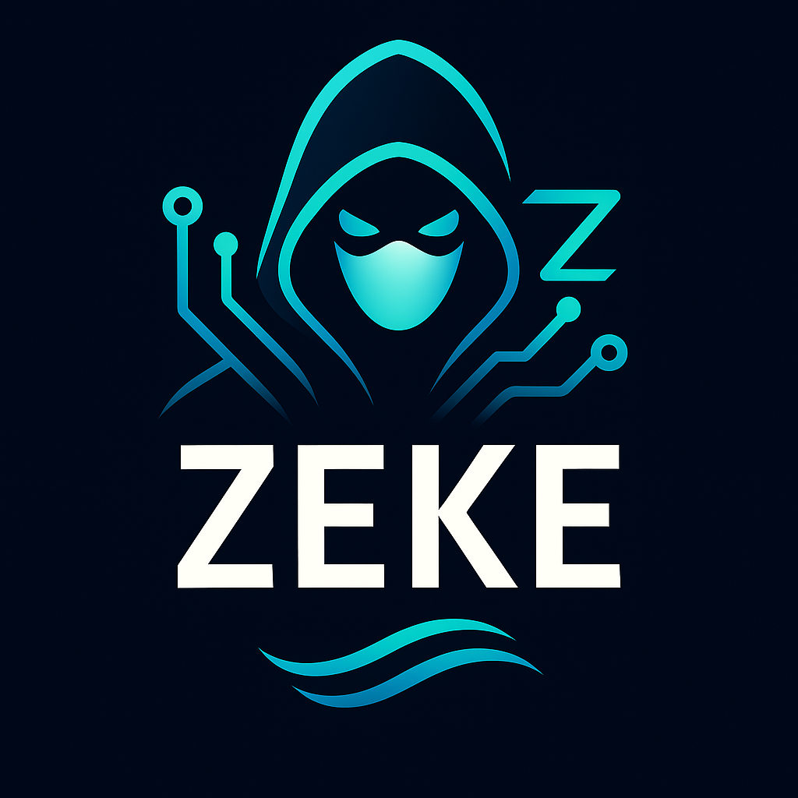

# Zeke.grim

<div align="center">
  

**AI-Powered Coding Assistant for Grim Editor**
*Claude Code meets Grim - Intelligent code completion, refactoring, and pair programming*


[](LICENSE)
[](https://github.com/ghostkellz/zeke.grim/releases)
[](https://github.com/ghostkellz/zeke.grim/stargazers)

</div>

---

## 🤖 Overview

**Zeke** is an AI-powered coding assistant deeply integrated into **Grim** editor, bringing the power of **Claude** (Anthropic's AI) directly into your workflow. Think **GitHub Copilot** meets **Claude Code CLI**, but native to the Ghost ecosystem.

### What is Zeke?

Zeke is both:
1. **🔌 Grim Plugin** - Native editor integration (written in Ghostlang)
2. **⚡ CLI Tool** - Standalone AI assistant for terminal workflows

Named after **Ezekiel** (biblical prophet who saw visions), Zeke provides:
- 🧠 **Intelligent Code Completion** - Context-aware suggestions
- 🔄 **Refactoring Assistant** - Safe code transformations
- 💬 **Chat Interface** - Ask questions about your codebase
- 🐛 **Bug Detection** - Find and fix issues automatically
- 📝 **Documentation Generation** - Auto-generate docs/comments
- 🧪 **Test Generation** - Create unit tests from code
- 🎨 **Code Review** - Get AI feedback on changes

---

## ✨ Features

### 🎯 **Core Capabilities**

| Feature | Status | Description |
|---------|--------|-------------|
| 💡 Inline Completions | ✅ | Ghost text suggestions as you type |
| 💬 Chat Interface | ✅ | Ask questions in split pane |
| 🔍 Codebase Search | ✅ | Semantic search across files |
| 🔄 Refactoring | ✅ | Rename, extract, inline operations |
| 🐛 Bug Detection | ✅ | Real-time issue detection |
| 📝 Doc Generation | ✅ | Auto-generate doc comments |
| 🧪 Test Generation | 🚧 | Create tests from functions |
| 🎨 Code Review | 🚧 | PR-style feedback |
| 🔧 Quick Fixes | ✅ | Apply AI-suggested fixes |
| 📊 Analytics | 🚧 | Code quality metrics |

### 🎨 **UI Components**

- **Chat Panel** - Persistent AI conversation sidebar
- **Inline Suggestions** - Ghost text à la Copilot
- **Quick Actions** - Context menu AI commands
- **Diff View** - Preview AI changes before applying
- **Command Palette** - `/ask`, `/refactor`, `/explain`, etc.

---

## 🚀 Installation

### Prerequisites

- **Grim** >= 0.1.0
- **Anthropic Google Sign-in or API Key** ([Get one here](https://console.anthropic.com/))
- **Ollama Models **
- **OpenAI API key or Google Sign-in** 

- **Ghostlang** runtime (bundled with Grim)

### Quick Install

#### Option 1: Via Phantom.grim (Recommended)

If using Phantom.grim distro:

```bash
# Zeke comes pre-installed!
# Just configure your API key:
grim --cmd "ZekeSetup"
```

#### Option 2: Standalone Installation

```bash
# 1. Clone Zeke plugin
git clone https://github.com/ghostkellz/zeke.grim.git ~/.config/grim/plugins/zeke

# 2. Add to your Grim config (~/.config/grim/init.gza)
require("plugins.zeke").setup({
    api_key = "YOUR_ANTHROPIC_API_KEY"  -- Or use env var
})

# 3. Restart Grim
grim
```

#### Option 3: CLI Tool Only

```bash
# Install zeke CLI globally
zig build -Drelease-safe
sudo cp zig-out/bin/zeke /usr/local/bin/

# Configure
zeke config set api_key YOUR_API_KEY

# Use from terminal
zeke ask "How do I implement a binary tree in Zig?"
```

---

## ⚙️ Configuration

### Environment Setup

```bash
# Option 1: Environment variable (recommended for security)
export ANTHROPIC_API_KEY="sk-ant-..."

# Option 2: Grim config file
# ~/.config/grim/lua/user/zeke.gza
```

### Grim Plugin Configuration

```ghostlang
-- ~/.config/grim/init.gza

local zeke = require("zeke")

zeke.setup({
    -- API Configuration
    api_key = os.getenv("ANTHROPIC_API_KEY"),  -- Secure: use env var
    model = "claude-sonnet-4-5-20250929",      -- Claude model to use

    -- Features
    inline_suggestions = true,                  -- Enable ghost text
    chat_panel = true,                          -- Show chat sidebar
    auto_complete = true,                       -- Auto-trigger completions

    -- UI
    chat_position = "right",                    -- "left", "right", "bottom"
    chat_width = 50,                            -- Width in columns
    ghost_text_hl = "Comment",                  -- Highlight group

    -- Behavior
    trigger_chars = { ".", ":", "(", " " },    -- When to suggest
    debounce_ms = 300,                          -- Delay before suggestion
    max_tokens = 2048,                          -- Max response length

    -- Keybindings
    keymaps = {
        accept = "<Tab>",                       -- Accept suggestion
        reject = "<Esc>",                       -- Dismiss
        next = "<C-]>",                         -- Next suggestion
        prev = "<C-[>",                         -- Previous suggestion
        chat_toggle = "<leader>z",              -- Open/close chat
        ask = "<leader>za",                     -- Ask question
        explain = "<leader>ze",                 -- Explain code
        refactor = "<leader>zr",                -- Refactor selection
        fix = "<leader>zf",                     -- Fix issues
        docs = "<leader>zd",                    -- Generate docs
    },
})
```

---

## 🎮 Usage

### Inline Completions (Copilot-style)

Just start typing - Zeke will suggest completions in ghost text:

```zig
fn fibonacci(n: u32) u32 {
    // Zeke suggests:
    //   if (n <= 1) return n;
    //   return fibonacci(n - 1) + fibonacci(n - 2);
}
```

Press `<Tab>` to accept, `<Esc>` to dismiss.

### Chat Interface

Open chat panel: `<leader>z`

```
┌─ Zeke AI Assistant ─────────────────────────┐
│ You: How do I read a file in Zig?          │
│                                             │
│ Zeke: Here's how to read a file in Zig:    │
│                                             │
│ ```zig                                      │
│ const std = @import("std");                 │
│                                             │
│ pub fn readFile(path: []const u8) ![]u8 {  │
│     const file = try std.fs.cwd()          │
│         .openFile(path, .{});              │
│     defer file.close();                     │
│                                             │
│     const content = try file.readToEnd     │
│         Alloc(allocator, 1024 * 1024);     │
│     return content;                         │
│ }                                           │
│ ```                                         │
│                                             │
│ > _                                         │
└─────────────────────────────────────────────┘
```

### Quick Commands

#### Ask Question
```
:Zeke ask How do I implement error handling in Zig?
```

#### Explain Code
Select code, then:
```
:Zeke explain
```

Output:
```
┌─ Code Explanation ──────────────────────────┐
│ This function implements a binary search    │
│ algorithm. It:                              │
│ 1. Takes a sorted slice and target value    │
│ 2. Uses divide-and-conquer approach         │
│ 3. Returns index if found, null otherwise   │
│                                             │
│ Time: O(log n), Space: O(1)                 │
└─────────────────────────────────────────────┘
```

#### Refactor Code
Select code, then:
```
:Zeke refactor extract function
```

Before:
```zig
pub fn main() !void {
    const result = x * 2 + y * 3;
    std.debug.print("{}\n", .{result});
}
```

After (Zeke suggests):
```zig
fn calculate(x: i32, y: i32) i32 {
    return x * 2 + y * 3;
}

pub fn main() !void {
    const result = calculate(x, y);
    std.debug.print("{}\n", .{result});
}
```

#### Fix Issues
Place cursor on error, then:
```
:Zeke fix
```

Zeke analyzes the error and suggests fixes.

#### Generate Documentation
```
:Zeke docs
```

Before:
```zig
pub fn parseJson(input: []const u8) !JsonValue {
    // ...
}
```

After:
```zig
/// Parses a JSON string into a JsonValue.
///
/// Parameters:
///   - input: Raw JSON string to parse
///
/// Returns:
///   - Parsed JSON value structure
///
/// Errors:
///   - ParseError if input is malformed
///   - OutOfMemory if allocation fails
pub fn parseJson(input: []const u8) !JsonValue {
    // ...
}
```

---

## 🔧 CLI Usage

Zeke also works as a standalone CLI tool:

### Basic Commands

```bash
# Ask a question
zeke ask "How do I implement a linked list in Zig?"

# Explain a file
zeke explain src/main.zig

# Generate tests
zeke test src/utils.zig

# Review changes
git diff | zeke review

# Generate commit message
git diff --staged | zeke commit

# Chat mode (interactive)
zeke chat
```

### Advanced Usage

```bash
# Refactor with specific instruction
zeke refactor --prompt "Extract this into a separate module" src/app.zig

# Generate docs for entire project
zeke docs --recursive src/

# Code review with context
zeke review --context "Focus on error handling" src/

# Custom model selection
zeke ask --model claude-opus-4 "Complex question..."
```

---

## 🎯 Keybindings Reference

### Default Keymaps

| Mode | Key | Action | Description |
|------|-----|--------|-------------|
| Insert | `<Tab>` | Accept | Accept inline suggestion |
| Insert | `<C-]>` | Next | Cycle to next suggestion |
| Insert | `<C-[>` | Previous | Cycle to previous |
| Normal | `<leader>z` | Toggle Chat | Open/close chat panel |
| Normal | `<leader>za` | Ask | Ask Zeke a question |
| Visual | `<leader>ze` | Explain | Explain selected code |
| Visual | `<leader>zr` | Refactor | Refactor selection |
| Normal | `<leader>zf` | Fix | Fix issue at cursor |
| Normal | `<leader>zd` | Docs | Generate docs |
| Visual | `<leader>zt` | Tests | Generate tests |
| Normal | `<leader>zc` | Review | Code review |

### Customization

```ghostlang
-- Override keybindings in your config
zeke.keymaps = {
    chat_toggle = "<leader>ai",     -- Changed from <leader>z
    accept = "<C-y>",                -- Changed from <Tab>
    -- ... customize as needed
}
```

---

## 🧪 Advanced Features

### Context-Aware Completions

Zeke understands your entire codebase:

```zig
// In file: src/database.zig
pub const Database = struct { /* ... */ };

// In file: src/main.zig
const db = Database.  // Zeke knows Database methods!
                      // Suggests: init(), connect(), query()
```

### Multi-File Refactoring

```
:Zeke refactor rename MyStruct -> DatabaseConnection
```

Zeke updates:
- All references across files
- Import statements
- Documentation
- Test files

### Smart Error Detection

Zeke proactively detects:
- Memory leaks
- Unhandled errors
- Type mismatches
- Logic errors
- Performance issues

### Codebase Chat

```
You: Where is user authentication implemented?
Zeke: User auth is in src/auth/login.zig, using JWT tokens.
      Related files:
      - src/auth/middleware.zig (validation)
      - src/models/user.zig (user model)
```

---

## 🏗️ Extension Architecture

Zeke can be extended with custom providers:

```ghostlang
-- Create custom AI command
zeke.register_command("optimize", function(context)
    local code = context.selection
    local prompt = "Optimize this code for performance:\n" .. code
    local result = zeke.ask(prompt)
    context.replace(result)
end)

-- Use it
:Zeke optimize
```

---

## 🔒 Security & Privacy

### API Key Safety

- ✅ Never commit API keys to git
- ✅ Use environment variables
- ✅ Encrypted storage option available

### Data Transmission

- 📡 Only sends relevant code context
- 🔒 HTTPS encrypted connection
- 🚫 No telemetry or tracking
- 💾 Optional local caching

### Privacy Mode

```ghostlang
zeke.setup({
    privacy_mode = true,  -- Strips sensitive info before sending
    cache_locally = true, -- Cache responses to reduce API calls
})
```

---

## 📊 Pricing & Limits

Zeke uses Anthropic's Claude API:

| Model | Input (per 1M tokens) | Output (per 1M tokens) |
|-------|----------------------|------------------------|
| Claude Sonnet 4.5 | $3.00 | $15.00 |
| Claude Opus 4 | $15.00 | $75.00 |
| Claude Haiku 3.5 | $0.25 | $1.25 |

**Typical usage:**
- Inline completions: ~100-500 tokens per request
- Chat: ~1k-5k tokens per conversation
- Refactoring: ~2k-10k tokens

**Cost-saving tips:**
- Use Haiku for simple completions
- Enable local caching
- Adjust debounce timing
- Disable features you don't need

---

## 🛣️ Roadmap

### v0.1.0 (Current)
- [x] Inline completions
- [x] Chat interface
- [x] Basic refactoring
- [x] CLI tool

### v0.2.0
- [ ] Test generation
- [ ] Code review
- [ ] Multi-cursor support
- [ ] Voice input

### v0.3.0
- [ ] Custom fine-tuned models
- [ ] Team collaboration features
- [ ] Analytics dashboard
- [ ] Plugin marketplace

### v1.0.0
- [ ] Production ready
- [ ] Enterprise features
- [ ] Self-hosted option
- [ ] Advanced security

---

## 🤝 Contributing

We welcome contributions!

### Areas We Need Help

- 🧪 Writing tests
- 📝 Documentation
- 🎨 UI/UX improvements
- 🔌 New commands/features
- 🐛 Bug fixes

See [CONTRIBUTING.md](CONTRIBUTING.md) for guidelines.

---

## 📚 Documentation

- **[Getting Started](docs/getting-started.md)** - Installation and setup
- **[Configuration](docs/configuration.md)** - All config options
- **[Commands Reference](docs/commands.md)** - Complete command list
- **[API Documentation](docs/api.md)** - For extension developers
- **[Troubleshooting](docs/troubleshooting.md)** - Common issues

---

## 🙏 Credits

Inspired by:
- **[GitHub Copilot](https://github.com/features/copilot)** - Inline suggestions
- **[Claude Code](https://www.anthropic.com/claude-code)** - AI-powered CLI
- **[Cursor](https://cursor.sh/)** - AI-first IDE
- **[Codeium](https://codeium.com/)** - Free AI completions

Powered by:
- **[Anthropic Claude](https://www.anthropic.com/)** - AI model
- **[Grim](https://github.com/ghostkellz/grim)** - Editor
- **[Ghostlang](https://github.com/ghostkellz/ghostlang)** - Plugin language

---

## ⚠️ Disclaimer

Zeke is an AI assistant - always review generated code before using in production. AI can make mistakes, especially with:
- Security-critical code
- Complex algorithms
- Edge cases
- Performance-sensitive sections

**Use Zeke to accelerate development, not replace understanding.**

---

## 📄 License

MIT License - See [LICENSE](LICENSE) for details.

---

<div align="center">

**Built with 🤖 by the Ghost Ecosystem**

[Grim](https://github.com/ghostkellz/grim) •
[Ghostlang](https://github.com/ghostkellz/ghostlang) •
[Phantom.grim](https://github.com/ghostkellz/phantom.grim)

⭐ **Star us on GitHub!** ⭐

*"Code smarter, not harder"* - Zeke

</div>
